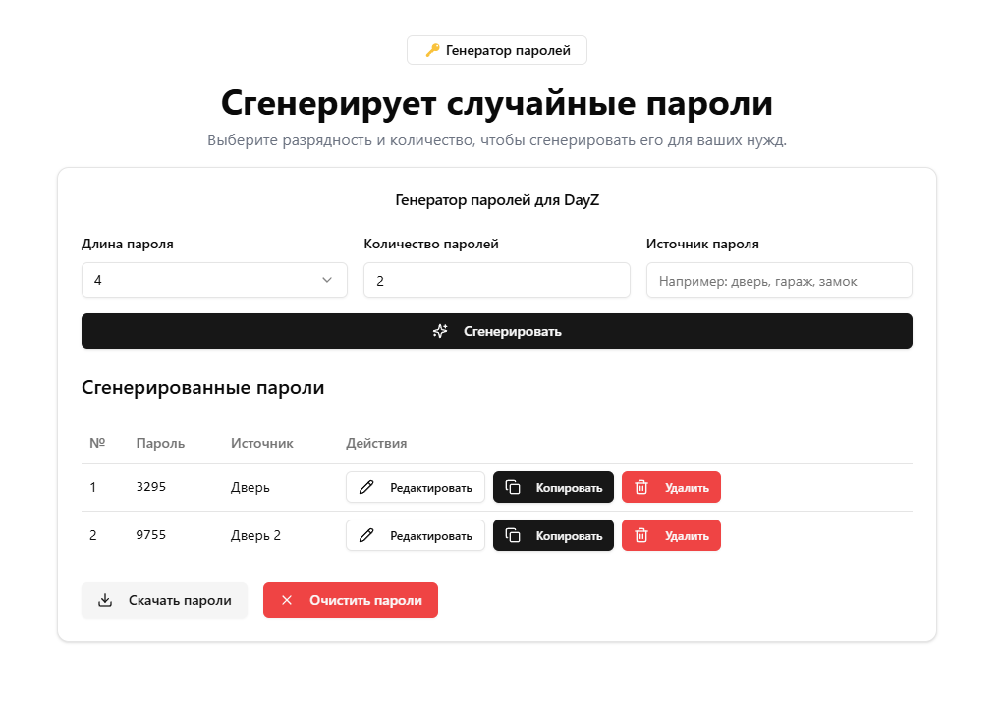

# DayZ Helper

[](https://github.com/IncludeSpecial/dayz-helper-web)

## О проекте / About

**RU:**  
DayZ Helper — это набор инструментов для выживания в DayZ, включающий генератор паролей, калькулятор рейда, интерактивную карту и многое другое. Проект создан для того, чтобы помочь игрокам быстро и эффективно управлять ресурсами и планировать рейды.

**EN:**  
DayZ Helper is a collection of survival tools for DayZ, including a password generator, raid calculator, interactive map, and more. This project is designed to help players manage resources and plan raids quickly and effectively.

---

## Функциональность / Features

### RU:
- **Генератор паролей:** Создавайте безопасные пароли для ваших баз и замков.
- **Калькулятор рейда:** Рассчитайте необходимые ресурсы для успешного рейда.
- **Интерактивная карта:** Планируйте рейды с помощью детальной карты.
- **История паролей:** Храните и управляйте паролями удобно и безопасно.

### EN:
- **Password Generator:** Create secure passwords for your bases and locks.
- **Raid Calculator:** Calculate the necessary resources for a successful raid.
- **Interactive Map:** Plan your raids using a detailed map.
- **Password History:** Store and manage your passwords safely and conveniently.

---

## Скриншоты / Screenshots

  
*Пример интерфейса генератора паролей / Example of the password generator interface.*

  
*Пример интерфейса калькулятора рейда / Example of the raid calculator interface.*

  
*Пример интерфейса игровой карты / Example of the game map interface.*

  
*Пример интерфейса истории паролей / Example of the history password interface.*


---

## Установка / Installation

### RU:
1. Склонируйте репозиторий:
   ```bash 
   git clone https://github.com/IncludeSpecial/dayz-helper-web.git 
   ```

2. Перейдите в директорию проекта и установите зависимости:
   ```bash  
   cd dayz-helper-web
   npm install

   ```
3. Запустите сервер разработки:
   ```bash  
   npm run dev
   ```

## Использование / Usage
Откройте приложение в браузере по адресу http://localhost:3000 и используйте навигацию для доступа к различным инструментам.

Open the application in your browser at http://localhost:3000 and use the navigation menu to access different tools.